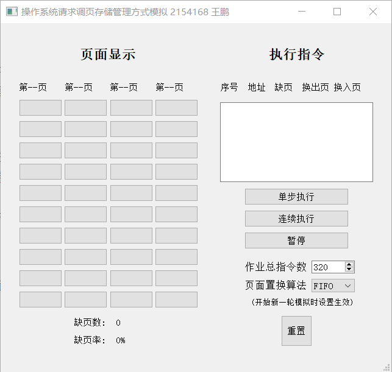
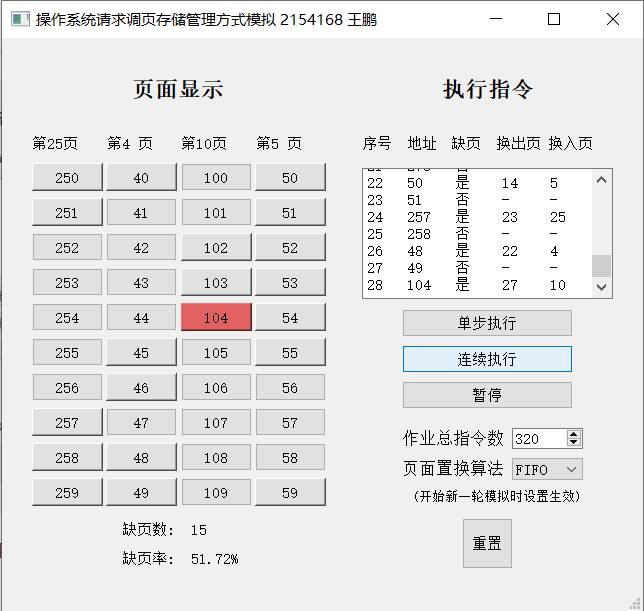

# Tongji-OS-PageSwapManagement

同济大学 2021 级-操作系统课-内存管理项目-请求调页存储管理方式模拟

## 项目需求

### 基本任务

假设每个页面可存放 10 条指令，分配给一个作业的内存块为 4。模拟一个作业的执行过程，该作业有 320 条指令，即它的地址空间为 32 页，目前所有页还没有调入内存。

### 模拟过程

- 在模拟过程中，如果所访问指令在内存中，则显示其物理地址，并转到下一条指令；如果没有在内存中，则发生缺页，此时需要记录缺页次数，并将其调入内存。如果 4 个内存块中已装入作业，则需进行页面置换。
- 所有 320 条指令执行完成后，计算并显示作业执行过程中发生的缺页率。
- 置换算法选用 FIFO 或者 LRU 算法
- 作业中指令访问次序按照下面原则形成：50%的指令是顺序执行的，25%是均匀分布在前地址部分，25％是均匀分布在后地址部分。

## 开发环境

- **开发环境** Windows 10
- **开发软件** PyCharm
- **开发语言** python 3.10
- **开发框架** pyqt5
- **开发工具** Qt Designer

## 项目结构

```
│  README.md
│
├─code
│  │  main.py
│  │  MainWindow.py
│  │  MainWindow.ui
│  │  manager.py
│  │  task.py
│
└─dist
  │  main.exe
```

## 项目展示

项目界面如下



在开始执行一次模拟之前，用户可以设定作业的总指令数(默认 320)与采用的页面置换算法(默认 FIFO)。置换算法包括 FIFO 与 LRU。

设定仅在一次模拟开始前生效，模拟过程中更改设定并不会生效。

当用户点击单步执行或连续执行后，一次模拟即开始，直到执行完设定的指令总数或者用户按下重置按钮后，一次模拟结束。

界面的左边分别展示分配给作业的四个页，每个页存储 10 条指令，竖向的十个按钮为一组，表示内存中的一页。每个按钮上显示该按钮存放的指令的地址(即 0 到作业总指令数减 1)，每组按钮的上方显示该内存页存放的指令是作业的哪一页。四组按钮的下方显示当前发生缺页情况的次数与当前的缺页率

每次执行指令后，以红色高亮按钮，显示本次执行的指令在内存中的位置。

界面的右侧包含一个文本框。其中主要打印指令的执行状况，如本次执行的指令的地址、是否发生缺页、换出页与换入页等。



## 设计方案

项目整体上分为四个部分，分别是要被模拟执行的作业(Task 类)，使用相应算法为作业分配页面的管理器(MyManager 类)，可视化界面(MainWindow 类)与负责调用管理器、更新界面、响应用户输入的程序主逻辑部分(MyThread 类)。

Task 类的主要作用在于模拟一份作业的指令执行过程。Task 类中包含一个页表，用于记录模拟作业的每一页在模拟分配的内存中的页面位置，未被分配内存则记为-1。Manager 每一次调用 Task 的执行函数，Task 都会向 Manager 返回当前要执行的模拟作业的指令的地址(即 0 到作业总指令数减 1)、该代码在模拟内存中的页面位置、该代码位于模拟作业的第几个页面，并按照项目要求的规则在 Task 中生成下一行指令的地址。

MyManager 类的主要作用在于模拟对一份作业的内存分配与页面调换。初始化 Manager 时，会根据设定的不同算法(FIFO 或 LRU)创建不同的数据结构与所需变量，并创建一个数组，模拟分配给 Task 的内存页面。

```
    def __init__(self, page_size, algo):
        self.task_memory_page_amount = 4  # 分配给任务的页面数
        self.page_size = page_size  # 页面尺寸
        self.task_page = [None for i in range(self.task_memory_page_amount)]  # 分配的页面 记录页面号
        self.code_num = 0  # 记录执行到第几条代码
        self.algo = algo  # 记录设定的管理器的算法
        self.page_allocated_amount = 0

        if self.algo == 'FIFO':  # 根据不同的算法配置不同的参数
            self.page_allocate_queue = queue.Queue()  # 记录页面分配顺序
        elif self.algo == 'LRU':
            self.unused_time = [None for i in range(self.task_memory_page_amount)]  # 记录页面未被使用的时间
```

MyThread 每一次调用 Manager 的执行函数 runTask 时，Manager 都会模拟执行一条 Task 的指令。随后，根据所选择的算法，Manager 为 Task 的指令分配模拟内存或者进行页面调换。执行完毕后，Manager 将本次模拟执行的必要信息返回给 MyThread，由 MyThread 根据这些信息进行可视化界面的更新

```
    def runTaskByFIFO(self, task):
        # 从task中获取当前要执行的代码的信息
        current_code_id, memory_page_for_code, code_page_id = task.getCurrentCodeId()
        # 初始化log 用于记录可视化界面所需信息
        code_num_log, cur_code_log, need_page_log, old_page_log, code_page_log, memory_page_log = 0, 0, False, -1, -1, -1
        if memory_page_for_code != -1:  # 在内存中
            ...
        else:  # 不在内存中
            if self.page_allocated_amount < self.task_memory_page_amount:  # 内存没有分配满
                ...
            else:  # 内存被分配满 进行页面调换
                ...
        ...
        return code_num_log, cur_code_log, need_page_log, old_page_log, code_page_log, memory_page_log
```

MyThread 的主要作用在于调用 Manager、更新界面并响应用户输入。每一次模拟开始前，MyThread 读取用户对作业最大指令数和页面调换算法的设置等，并根据这些设定初始化 Task 与 Manager。

```
# 模拟参数初始化
page_size = 10
code_amount = ui.spinBox.value()  # 从用户输入读取任务代码数
page_swap_algo = ui.comboBox.currentText()  # 从用户输入读取所选算法
# 任务初始化
task = Task(page_size=page_size, code_amount=code_amount)
# 管理器初始化 传入不同的算法参数 则后续调用runTask时执行不同的算法
manager = MyManager(page_size=page_size, algo=page_swap_algo)
# 缺页数初始化
page_missing = 0
```

模拟开始后，MyThread 循化读取当前运行模式(单步执行、连续执行、暂停与重置等等)，并调用 Manager 执行模拟或重置模拟，随后向可视化界面上更新模拟信息。

```
# 根据设定的调页算法进行Task代码执行，并获取Task代码执行情况与调页情况
code_num, cur_code, need_swap, old_page, code_page, memory_page = manager.runTask(task)
...
# 更新界面
self.my_trigger_update.emit(code_num, cur_code, need_swap, old_page, code_page, memory_page, page_missing, page_size, code_amount)
```
